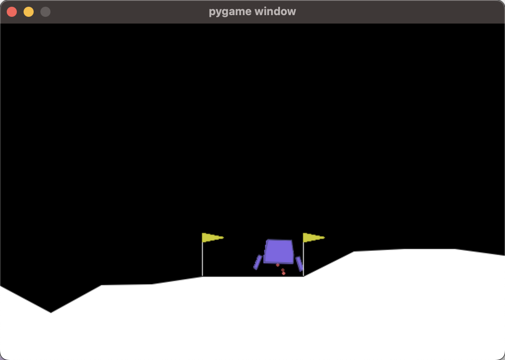

# 基于DQN的Lunar Lander控制

最近在浅浅地学习一些RL相关内容，建立本repo仅做学习记录。本人工程渣，请见谅！
如有错误，请不吝赐教！小弟拜谢。

## 安装相关库

```zsh
conda install gym[all]
conda install torch
```

## 运行

先运行[`lunar_lander_train.py`](./lunar_lander_train.py)  
再运行[`lunar_lander_run.py`](./lunar_lander_run.py)

## 降落



## 参考资料

[DQN](https://pytorch.org/tutorials/intermediate/reinforcement_q_learning.html)
